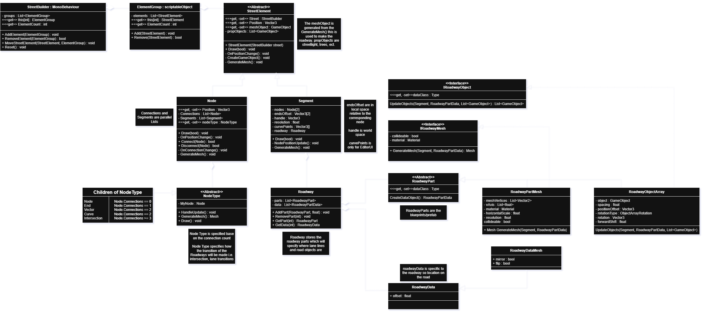

 

  

  <h3 align="center">Decently Good Street Builder</h3>

  

    A package for Unity 6 for procedurally generated roadways and intersections
     
    <!--
    <a href="https://github.com/polcamden/Decently-Good-Street-Builder">View Demo</a>
    &middot;
    -->
    <a href="https://github.com/polcamden/Decently-Good-Street-Builder/issues/new?labels=bug&template=bug-report---.md">Report Bug</a>
    &middot;
    <a href="https://github.com/polcamden/Decently-Good-Street-Builder/issues/new?labels=enhancement&template=feature-request---.md">Request Feature</a>
  

  
Table of Contents

  <a href="#about-this-project">- About this Project -</a> 
    <a href="#getting-started">- Getting Started -</a> 
      <a href="#installation">Installation</a> 
      <a href="#basics-of-use">Basics of Use</a> 
      <a href="#custom-road-parts">Custom Road Parts</a> 
      <a href="#custom-roadways">Custom Roadways</a> 
    <a href="#roadmap">- Roadmap -</a> 
    <a href="#technical">- Technicals -</a> 
    <a href="#license">- License -</a> 
    <a href="#contact">- Contact -</a> 

## About this Project
Decently Good Street Builder (DGSB) is a package for Unity 6 that allows for roadways and intersections to be created procedurally.

## Getting Started
### Installation
Todo
### Getting Started
#### Set Up
- To Start using Decently Good Street Builder create a street builder object in the top menu GameObject -> StreetBuilder, This creates an empty object with a StreetBuilder script. 
- To use roadway assets first create a Asset Library window in the top menu Tools -> Decently Good Street Builder -> Asset Library, mount the window anywhere perferably under the inspector. in the settings of the Asset Library copy the path of where your roadway assets are into the list of asset paths. Reload to show the assets in the window. 
#### Usage
- To edit the street selected the StreetBuilder object, in the scene tools menu select "Street Builder Editor Mode".
- Within the editor mode there are two tools, move and select.
- using the move tool right click -> Create Node will create a node at (0,0,0).
- To connect nodes us the select or move tool, shift+click both nodes to select both right click -> Connect Nodes. This creates a segment between the 2 selected nodes.
- To assign a roadway asset to the segment select the segment using the select tool. In the asset library window press use. 
### Custom Road Parts
Todo
### Custom Roadways
Todo

## Roadmap

## Technical
This UML diagram needs to be remade, but it gives an outline. 

